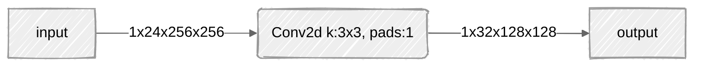
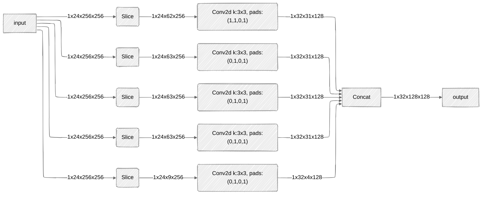

# ONNX Partitioner

This is an ONNX graph partitioner, that accepts a `.onnx` model and outputs a `_partitioned.onnx` model. It currently supports

- [x] Conv2d
- [ ] Gemm

Features:

* Automatically partition Conv2d operations.
* ONNX-compatible formats for compatibility and facilitating early-stage validation.
* Support automatically choosing the height or width partition plan accordingly.
* Automatically choose suitable padding for partitioned sub-nodes.

**Note**: This is an experimental tool that may still contain bugs.

## Install

1. Clone this repository.

```bash
git clone https://github.com/AllinLeeYL/onnxpartitioner.git
```

2. Install as a local package.

```bash
cd onnxpartitioner && pip install -e .
```

3. Optional: check the correctness of implementation. Note that to run test scripts, you will need to install extra dependencies. `pip install torchinfo termcolor tqdm`

```bash
cd test
python3 _check_conv_partitioner.py
```

## Usage

```bash
$ onnxpartitioner --help
usage: onnxpartitioner [-h] [--in_channel IN_CHANNEL] [--in_pixel IN_PIXEL] [--out_channel OUT_CHANNEL]
                       [--out_pixel OUT_PIXEL] [--direction {auto,vertical,horizontal}] [--opset OPSET]
                       model

ONNX model partitioner

positional arguments:
  model                 path to model.pt file.

options:
  -h, --help            show this help message and exit
  --in_channel IN_CHANNEL
                        input buffer channel size
  --in_pixel IN_PIXEL   input buffer pixel size
  --out_channel OUT_CHANNEL
                        output buffer channel size
  --out_pixel OUT_PIXEL
                        output buffer pixel size
  --direction {auto,vertical,horizontal}
                        partition direction of 2d array
  --opset OPSET         onnx opset version of the partitioned model
```

For example, you have a ONNX model named "my_conv2d.onnx". You can partition it by executing the command below.

```bash
$ onnxpartitioner --in_channel 24 --in_pixel 4096 --out_channel 24 --out_pixel 4096 my_conv2d.onnx
```

The partitioner will partition the graph automatically. 

## Example 

For example, you have a single Conv2d node model, accepting a 256x256 image of 24 channels and outputting a 128x128 image of 32 channels. The kernel size is 3x3. The padding is (1, 1, 1, 1).



Imagine that you have hardware with input buffer and output buffer parameters as follows:

```yaml
input_buffer: 
	channel: 256
	spatial_pixel: 16384
output_buffer: 
	channel: 256
	spatial_pixel: 16384
```

You execute `onnxpartitioner --in_channel 256 --in_pixel 16384 --out_channel=256 --out_pixel 16384 model.onnx`

Basically, the partitioner will return a graph like the one below.



This partitioner can automatically divide the big Conv2d node into multiple sub-nodes that can fit into the hardware limitations. First, it creates slice nodes to slice the input. Then, it substitutes the original Conv2d node with multiple sub-nodes. Finally, it adds a Concat node to the end to concatenate all the results together. 

The operations are all based on the ONNX graph, so that I can validate the correctness of the implementation. The input and output image indices of neural accelerators can then be easily calculated by extracting the parameters of the Slice node as well as the Conv2d node.

## Known Issues

* When testing with `--use_cuda`, the difference between the original model and the partitioned one becomes noticeable. This may be caused by the difference in computation precision and backend implementation between the CPU and the GPU. 